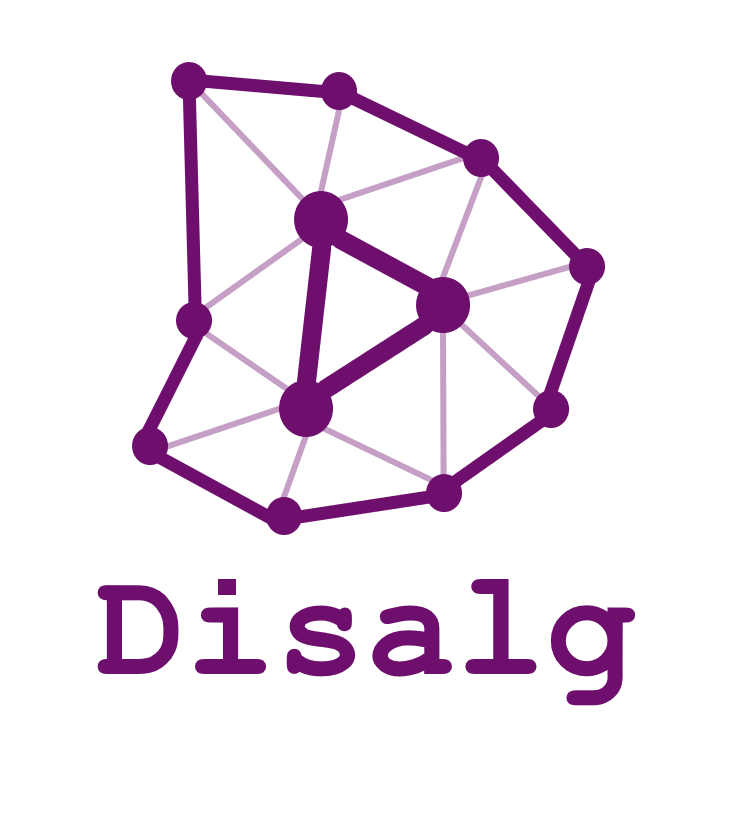

# Distributed algorithm design and implementation

Disalg group, Institute of Computer Software, Nanjing University

## Disalg Projects

* [Paxos Refinement](https://github.com/Starydark/Paxos-Refinement) 
* [CRPQ (Conflict-free Replicated Priority Queue)](https://github.com/elem-azar-unis/CRPQ-Redis)
* [Consistency-Latency Tradeoff of Quorum Replication](https://github.com/Lingzhi-Ouyang/Consistency-Latency-Tradeoff)
* [Prototype Collaborative Editor based on the Jupiter Protocol](https://github.com/tangruize/coeditor)

## Links

* People
    * [Yu Huang](http://cs.nju.edu.cn/yuhuang) 
    * [Hengfeng Wei](https://github.com/hengxin)

* Resources
    * [Awesome distributed computing](https://github.com/Disalg-ICS-NJU/awesome-distributed-computing/blob/master/awesome-distributed-computing.md)
    * [BibDict of Disalg](https://github.com/alg-nju/disalg-bib-dict/blob/master/README.md)

